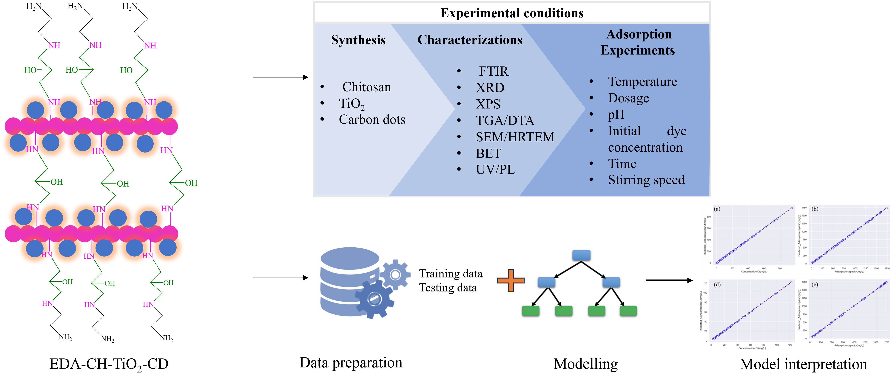

Machine learning approaches to predict adsorption performance of sugarcane derived-carbon dot -based composite in the removal of dyes
=============================================================================

This study addresses the imperative need for environmentally friendly wastewater treatment to degrade harmful organic compounds. It highlights challenges in uniformly blending nanofillers into polymer matrices and explores regeneration processes. Chitosan, a versatile biopolymer, is studied for its active sites effective in adsorbing anionic dyes. Modifying chitosan's performance through degree of deacetylation adjustment is explored using crosslinkers like ethylenediamine and epichlorohydrin. Titanium oxide (TiO2) and carbon dots (CDs) are chosen as nanofillers for their stability, biocompatibility, and cost-effectiveness, enhancing mechanical strength and adsorption performance. The study integrates experimental investigations with artificial intelligence techniques, utilizing machine learning algorithms through Python. Notably, the Random Forest model accurately forecasts system behavior. The research aims to develop algorithms assessing composite adsorption capacity with different functionalization methods, optimizing synthetic wastewater treatment. Adsorption isotherms, kinetics, thermodynamics, and continuous studies further evaluate composite performance. The composite exhibits consistent adsorption capacity over five cycles, demonstrating its reusability. The study concludes by suggesting the process through which dyes are absorbed onto the composite. This comprehensive investigation contributes to advancing sustainable wastewater treatment through innovative nanocomposites and sophisticated modeling techniques.
